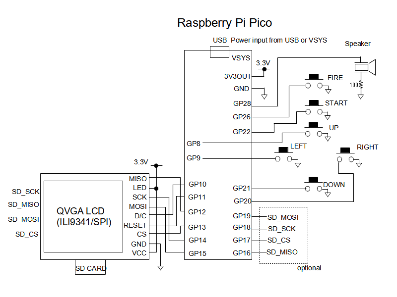

# 回転スクロールシューティングゲーム　VELUDDA for Raspberry Pi Pico (Rotating scroll shooting game)
ラズベリーPi PicoにQVGAの液晶を接続して画面が回転しながらスクロールする本格的シューティングゲームです。  
とてもシンプルな回路なので、簡単に製作することができます。  
液晶は240x320ドット、コントローラにILI9341を搭載したSPI接続のものに対応しています。  
VELUDDAについての詳細は<a href="http://www.ze.em-net.ne.jp/~kenken/veludda/index.html" target="_blank">こちら</a>  

## 実行方法
ラズベリーPi PicoのBOOTSELボタンを押しながらPCのUSBポートに接続し、バイナリーファイル veludda_pico.uf2 をラズベリーPi Picoにコピーしてください。  
veludda_pico.uf2は/buildディレクトリにあります。  
  
## ソースプログラムのビルド方法
ソースプログラムのビルドにはRP2040に対応したコンパイラの他、CMake、pico-sdkが必要です。  
SDKが使用できる環境設定をした上で、ダウンロードした拡張子が.c .h .txt .cmakeのファイルを同じフォルダに入れてビルドしてください。  
  
  
  